# 图论

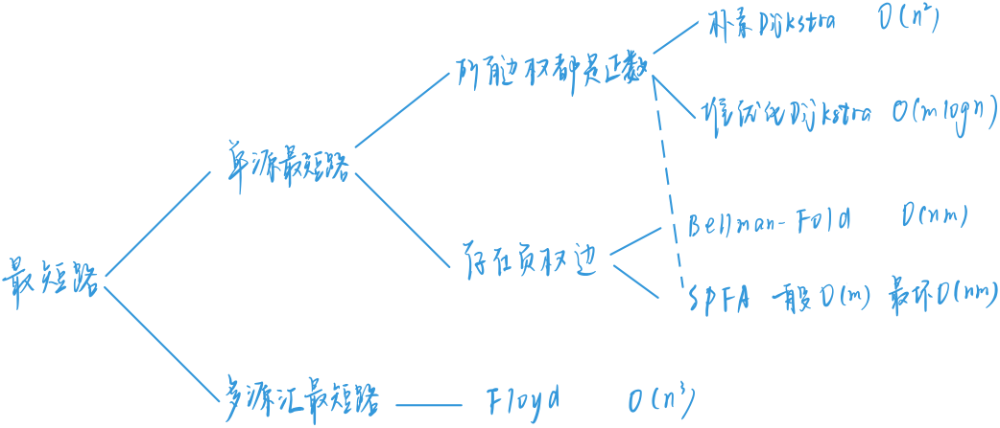

‍

​

## 单源最短路算法（非负权边）

### 朴素Dijkstra算法（稠密图）

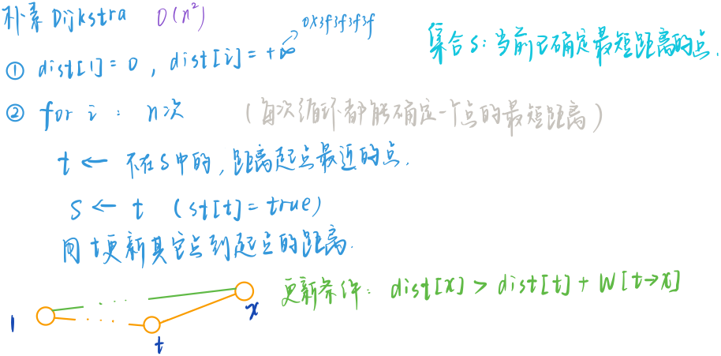​

dijkstra是基于贪心算法的，如果有负权边的话，会导致贪心算法的不正确，比如：

a->b = 50,a->c = 60,c->b = -100，那么其实a->b的最短路径应该是a - c - b，但是贪心算法会在第一步就确定下来到b的最短路径是50。

该算法的核心在于将所有的点划分为两个部分，一部分是到源点的最短距离已经确定了的点，另一部分则是还没有确定的。每次我们在还没有确定最短距离的所有点中找到一个距离源点最近的，这个点就是新的确定的点，然后我们利用这个最新的点来更新其余还没有确定的点的最短距离。直至所有点的最短距离都已经确定了。

我们使用st数组标记每个点是否已经确定了，dist数组标记每个点到源点的最短距离。

时间复杂度：O(n2)O(n2)，空间复杂度o(n2)

```cpp
#include <bits/stdc++.h>
using namespace std;
int n,m;
const int N = 510;
int dist[N]; //定义到起点的最小值
bool st[N]; //判断是否确定为最小距离  是否已经遍历过了
int g[N][N];
int Dijkstra(){
    memset(dist,0x3f,sizeof dist);
    dist[1] = 0;
    for (int i = 0; i < n; ++i) {
        int t = -1;  //这里处理是因为需要确保有一个路径
        for (int j = 1; j <= n ; ++j) {
            if(!st[j] && (t == -1||dist[t] > dist[j])) { // 找未确定最短距离的最小值
                t = j;
            }
        }
        st[t] = true;
        for (int j = 1; j <= n ; ++j) {
            dist[j] = min(dist[j] , dist[t] + g[t][j]);
        }
    }
    if(dist[n] == 0x3f3f3f3f) return -1;
    else return dist[n];
}
```

### 堆优化版dijkstra算法（稀疏图）

首先我们在朴素dijkstra算法中发现，我们每次都要为了遍历n个顶点来找到下一个当前最小值，我们很自然的就会想到使用小顶堆来优化查找当前最小值。

首先我们使用链式前向星来存储稀疏图：链式前向星主要原理就是使用静态数组来模拟链表存储以每个点为起点的所有边。

最后判断一下1号点和n号点是否是联通的。

时间复杂度：O(mlogn)O(mlogn)，适用于稀疏图。

```cpp
#include <bits/stdc++.h>
using namespace std;
const int N = 100010;
int n;
int m;
typedef pair<int,int> PII;
vector<list<PII>> g;            //这里用邻接表存储，稀疏图  其中对于g而言相当二维数组其中二维坐标表示的pair类型 first代表目标结点，second代表的权值
int dist[N];                      //到第n个结点的距离
bool st[N];                      //表示第n个结点是否被修改过

int Dijkstra(){
    memset(dist,0x3f,sizeof dist);  //定义所有的边长都为正无穷
    dist[1] = 0;                                 //定义自身结点到1的距离为0；
    priority_queue<PII,vector<PII>,greater<PII>> heap;   // 定义一个pair类型的小根队  其中first为距离，second为节点编号
    heap.push({0,1});

    while(heap.size()){
        auto t = heap.top();    //取出到源节点距离最小的节点位置
        heap.pop();

        int node = t.second;

        if(st[node]) continue; //如果该节点被修改过，跳过
        st[node] = true;       //不然的话将其标记已修改 并对其进行以下操作

        for (auto li : g[node]) {
            int newnode = li.first;
            int w = li.second;
            if(dist[newnode] > dist[node] + w){
                dist[newnode] = dist[node] + w;
                heap.push({dist[newnode] ,newnode});
            }
        }
    }
    if(dist[n] == 0x3f3f3f3f) return -1;
    return dist[n];
}
```

## 单源最短路径（有负权边）

### Bellman-Ford算法

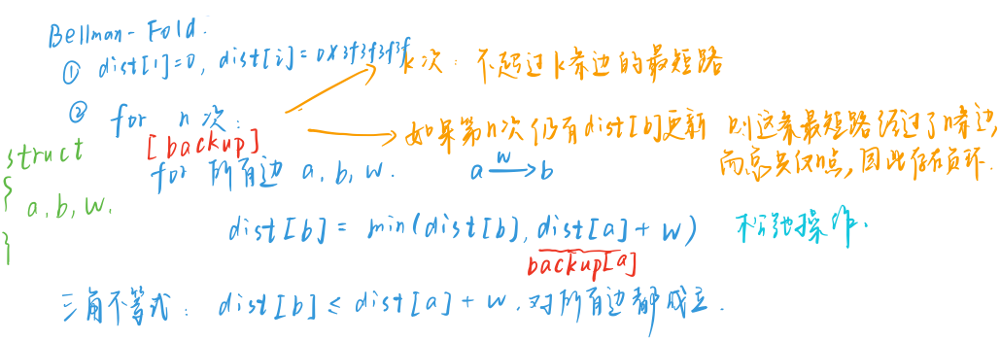

‍

​

我们知道dijsktra算法没有办法处理负权边，自然提出了能够判断负权边的最短路算法。我们需要知道这样一个事实，在nn个顶点的图中，任意两个点之间的最短路径最多经过n - 1条边。那么我们可以使用动态规划的思想来求解最短路问题，以及最多经过k个顶点的最短路问题，判断负环问题。

Bellman-Ford算法本质上是一个使用滚动数组优化的动态规划。在第i次迭代后，dist[to]代表的是最多经过i条边到达点的最短距离。

我们首先读入所有的边，这里使用Edges数组存储所有的边，dist数组存储最短路，backup数组作为备份滚动数组。在第i次迭代当中，我们都需要遍历所有的边(from,to)，我们判断能够通过这条边使我们到达节点to的距离变小。即状态转移为：  

$$
dist[to]=min(dist[to],backup[from]+weight)
$$

其中backup[from]代表了只经过i - 1条边到达from的最短距离。

遍历完成之后，我们需要判断1号点和n号点是否联通，这时候不能直接判断是否等于0x3f3f3f3f，这是因为如果另有一个点p和1号点也不联通，但是和n号点联通，并且dist[p][n] < 0，那么在更新的时候，就会将dist[n]变成一个略小于0x3f3f3f3f的值。

另外，如果没有最大边数限制的话，我们可以不用使用backup数组。

另外，我们可以执行n次迭代，如果第n次迭代，还有一些边的最短路被修改了，说明这时候存在了负环。

时间复杂度分析O(n∗m)

```cpp
#include <bits/stdc++.h>

using namespace std;
const int N = 505 , M = 10010;
int n , m ,k;
int dist[N];   //记录原点到其他n点的距离
int backup[N];  // 备份
struct Edge{
    int a,b,w;
}edge[M];

void bellman_ford(){
    memset(dist,0x3f, sizeof dist);
    dist[1] = 0;
    for (int i = 0; i < k; ++i) {
        memcpy(backup,dist,sizeof dist);
        for (int j = 0; j < m; ++j) {
            int a = edge[j].a;
            int b = edge[j].b;
            int w = edge[j].w;
            dist[b] = min(dist[b],backup[a]+w);   //这里一定要用backup备份的数组来看 不然会出现连续调用
        }
    }

}
```

### SPFA（Shortest Path Fast Algorithm）

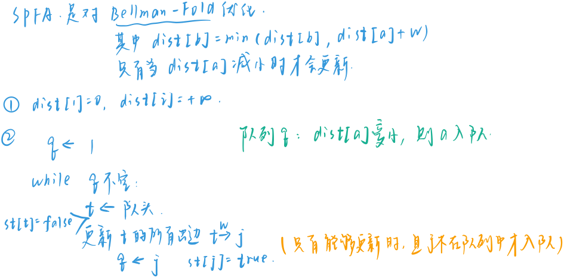​

SPFA其实就是对列优化版本的Bellman-Ford算法，但需要指出的是其平均时间复杂度虽然是O(m)O(m)，但是其最坏时间复杂度是O(nm)O(nm)，并且出题人喜欢卡这一点。所以也有很多衍生的针对SPFA的优化算法。

SPFA的思路大概如下：

1.使用一个队列来保存待优化的节点。我们使用state数组标记节点i是否在队列中，初始时只有源点1在队列中。  
2.每次取出队列中一个首节点p，并遍历所有以点p为起点的边e和对应的终点j，如果经过点p到达点j点的路径可以变得更短，那么我们更新dist[j]，同时如果节点j不在队列中，并且将j加入队列，这是因为如果到j的最短路径更新了，那么经过j点到其他节点的路径很有可能也要更新。  
3.重复上述操作，直至队列为空。

  
如果我们希望判断图中是否存在负环，我们可以使用一个计数数组，表示从源点到某点最短路中经过的点数。如果该点数大于n那么说明存在负环。

```cpp

#include <bits/stdc++.h>
using namespace std;
const int N = 100010;
int n;
int m;
typedef pair<int,int> PII;
vector<list<PII>> g;            //这里用邻接表存储，稀疏图  其中对于g而言相当二维数组其中二维坐标表示的pair类型 first代表目标结点，second代表的权值
int dist[N];                      //到第n个结点的距离
bool st[N];                      //表示是否在队列中  避免重复判断  没有这个标记数组其实也没有问题 为了降低时间复杂度而已

int spfa(){
    memset(dist,0x3f,sizeof dist);
    dist[1] = 0;

    queue<int >q ;
    q.push(1);
    st[1] = true;   //表示1这个节点在队列中  防止重复调用

    while(q.size()){     //当队列中 没有元素时 停止遍历  这里使用bfs
        int t = q.front();
        q.pop();
        st[t] = false;   //表示t 这个节点已经处理过

        for (auto li : g[t]) {
            int j = li.first;
            int distance = li.second;
            if(dist[j] > dist[t] + distance){
                dist[j] = dist[t] + distance;
                if(!st[j]) {
                    q.push(j);
                    st[j] = true;
                }
            }
        }
    }
    return dist[n];
}
```

### SPFA求负环

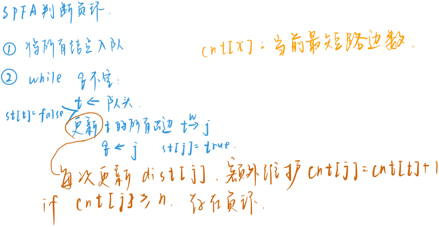​

在求解负环的时候，我们使用cnt数组标记从源点到点i的最短路最少要经过多少个点，如果超过了n - 1，那么说明存在负环。另一方面，此时我们不能只把源点放入队列，而应该把所有的点都放入队列，为了防止负环和源点不在一个联通块里面。

‍

‍

## 多源最短路径算法

### Floyd算法

Floyd算法能够处理负权边，但是无法处理有负环的情况。

时间复杂度O(n3)O(n3)，空间复杂度O(n2)O(n2)。

Floyd算法也是采用了动态规划的思想，在第k次迭代中后，dist[i][j]代表只经过前k个点作为中转，顶点i,j之间的最短距离。

```cpp
int n, m;
int d[N][N];

void init()
{
    for (int i = 1; i <= n; i++)
        for (int j = 1; j <= n; j++)
            if (i != j) d[i][j] = INF;
}

void floyd()
{
    for (int k = 1; k <= n ; k++)
        for (int i = 1; i <= n; i++)
            for (int j = 1; j <= n; j++)
                d[i][j] = min(d[i][j], d[i][k] + d[k][j]);
}

‍‍‍```
```

## 最小生成树

最小生成树算法指的是：给定一张边带权的无向图G=(V, E)，其中V表示图中点的集合，E表示图中边的集合，n=|V|，m=|E|。

由V中的全部n个顶点和E中n-1条边构成的无向连通子图被称为G的一棵生成树，其中边的权值之和最小的生成树被称为无向图G的最小生成树。

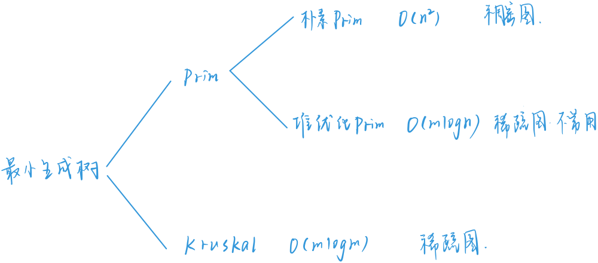​

### 朴素Prim

Prim算法的思路如下：

初始化点集合Vnew=xVnew=x，Vold=V−VnewVold=V−Vnew，xx为图中任何一个顶点，初始化所有VoldVold集合中点yy到VnewVnew的距离为graph(x,y)graph(x,y)。  
在VoldVold集合中找到距离VnewVnew距离最小的点tt，我们将tt加入VnewVnew，将点tt到最小生成树的距离计入答案，如果该距离是infinf，说明图不联通，同时使用tt点来更新VoldVold中的点到VnewVnew的距离。  
重复上述步骤二n−1n−1次，得到最小生成树。  
具体到代码，我们使用visit数组判断节点是否在VnewVnew集合中。

适用于点数比较小，边比较多的稠密图。

时间复杂度：O(n2+m)

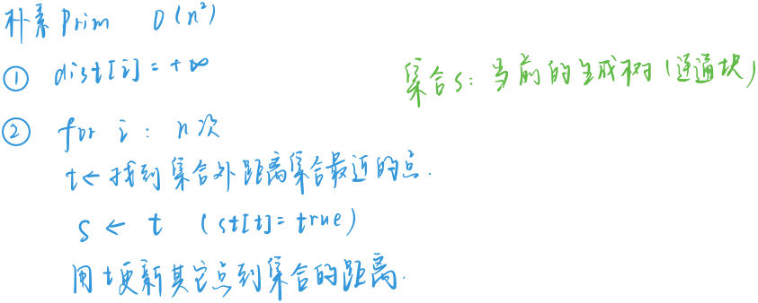​

```cpp
int n, m;
int g[N][N];
int dist[N]; // dist[i]：i到集合的距离
bool st[N];

int prim()
{
    memset(dist, 0x3f, sizeof dist);

    int res = 0; // 最小生成树的边权之和
    for (int i = 0; i < n; i++)
    {
        int t = -1; // 找到集合外距离集合最近的点
        for (int j = 1; j <= n; j++)
            if (!st[j] && (t == -1 || dist[j] < dist[t]))
                t = j;

        // 如果不是第一个点，并且这个点到集合已经不连通了，就返回
        if (i && dist[t] == INF) return INF;

        // 不是第一个数, 把t加到最小生成树
        if (i) res += dist[t]; 

        st[t] = true; // 把t加入集合

        // 用t->j的距离，更新集合外的j到集合的距离
        for (int j = 1; j <= n; j++)
            dist[j] = min(dist[j], g[t][j]);
    }

    return res;
}
‍‍```
```

### Kruskal

Kruskal算法和Prim不同的是：Prime算法每次将一个点加入到最小生成树中，而Kruskal算法则是每次选择一条边加入到最小生成树中。Kruskal算法的整体流程如下：

将所有的边按照长度从小到大排序。  
每次选择一条最小的边，且边的两个端点不在同一个联通块中。  
重复上述步骤二，直至所有的边都被遍历完了。  
这里最困难的步骤就是如何判断两个端点是否在同一个联通块中，我们使用并查集来进行判断。

时间复杂度：O(mlogm)

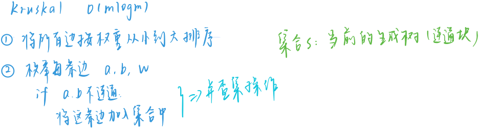​

```cpp
int n, m;
int p[N];   // 并查集的父节点数组

struct Edge
{
    int a, b, w;

    bool operator< (const Edge &W)const
    {
        return w < W.w;
    }
}edges[M];

int find(int x)
{
    if (p[x] != x) p[x] = find(p[x]);
    return p[x];
}

int kruskal()
{
    sort(edges, edges + m);

    for (int i = 1; i <= n; i ++ ) p[i] = i; // 初始化并查集

    int res = 0, cnt = 0; // res:最小生成树边权之和，cnt:当前加入的边数
    for (int i = 0; i < m; i ++ )
    {
        int a = edges[i].a, b = edges[i].b, w = edges[i].w;

        a = find(a), b = find(b);
        if (a != b)     // 不连通，就把这条边加到生成树里 
        {               // (并查集初始状态，任意两点之间都是不连通的)
            p[a] = b;
            res += w;
            cnt ++ ;
        }
    }

    if (cnt < n - 1) return INF;
    return res;
}
‍‍```
```

## 二分图

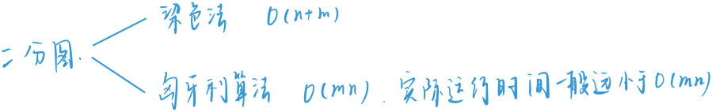​

### 染色法

设G=(V,E)G=(V,E)是一个无向图，如果顶点VV可分割为两个互不相交的子集(V1,V2)(V1,V2)，并且图中的每条边（i，j）（i，j）所关联的两个顶点ii和jj分别属于这两个不同的顶点集i∈V1,j∈V2i∈V1,j∈V2，则称图GG为一个二分图。

即如果我们能够把图中的所有顶点分成两部分，然后对于任何一条边，他的两个端点都在不同的点集合中。判断二分图的一个等价条件是图中不存在奇数顶点的环。

因此我们可以使用染色法来解决这样的问题，我们每次选取图中一个没有染色的点将其染成颜色1，将其相邻的还没有染色的顶点染成相反的颜色，如果发现相邻的颜色和当前染的颜色相同的话，说明发生了冲突。

我们可以使用BFS或者DFS来完成染色的过程。

‍

时间复杂度：O(n+m)

```cpp
#include "bits/stdc++.h"
using namespace std;
const int N = 100010 , M = 200010;

int n ,m;
vector<list<int>> h(N);
int color[N];

bool dfs(int u ,int c){
    color[u] = c;
    for (auto t : h[u]){
        if(!color[t]){
            if(!dfs(t,3-c)) return false;
        }
        else if(color[t] == c) return false;
    }
    return true;
}

```

### 匈牙利算法(最大匹配）

二分图的匹配：给定一个二分图GG，在GG的一个子图MM中，MM的边集EE中的任意两条边都不依附于同一个顶点，则称MM是一个匹配。匹配本质上是一个边的集合，且任意两个边没有交点。

二分图的最大匹配：所有匹配中包含边数最多的一组匹配被称为二分图的最大匹配，其边数即为最大匹配数。

我们这里主要使用匈牙利算法来进行求解，在介绍算法之前，我们需要介绍两个概念：

交错路径：给定图G的一个匹配M，如果一条路径的边交替出现在M中和不出现在M中，我们称之为一条M-交错路径。

增广路径：而如果一条M-交错路径，它的两个端点都不与M中的边关联，我们称这条路径叫做M-增广路径。

如下图：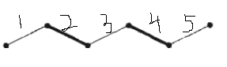​

对于匹配M={2,4}其中边集{2,3,4}是一个交错路径，边集{1,2,3,4,5}是一个增广路径。

我们可以发现，对于一个增广路径，我们可以就可以将其中匹配边变成非匹配边，非匹配边变成匹配边。得到一个更大的匹配{1,3,5}。所以我们的目标就转化成在图中不停的找到增广路径。

‍

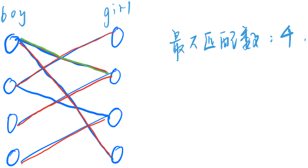​

‍

```cpp
#include "bits/stdc++.h"
using namespace std;
const int N = 510 , M = 100010;
int n1,n2,m;
vector<list<int>> h(N);
bool st[N];
int match[N];

int find(int x){
    for (auto t :h[x]) {
        if(!st[t]){
            st[t] = true;
            if(!match[t] || find(match[t])){
                match[t] = x;
                return true;
            }
        }
    }
    return false;
}
```

## 拓扑排序

拓扑排序指的是：对一个有向无环图(Directed Acyclic Graph简称DAG)G进行拓扑排序，是将G中所有顶点排成一个线性序列，使得图中任意一对顶点u和v，若边<u,v>∈E(G)，则u在线性序列中出现在v之前。通常，这样的线性序列称为满足拓扑次序(Topological Order)的序列，简称拓扑序列。简单的说，由某个集合上的一个偏序得到该集合上的一个全序，这个操作称之为拓扑排序。

拓扑排序的思路非常的直观：

统计所有节点的入度，如果某些节点的入度等于0，说明他们不依赖于任何前驱节点，我们将这些节点加入队列。  
我们依次将队列中的节点取出来，将以该节点为起点的所有边对应的终点的入度减去1。如果此时终点的入度等于0，我们将该节点加入队列。  
重复执行上述步骤，直至队列为空。如果所有的节点都已经被加入到队列过，就存在一个拓扑排序，并且出队列的顺序就是一个拓扑排序。否则不存在。
